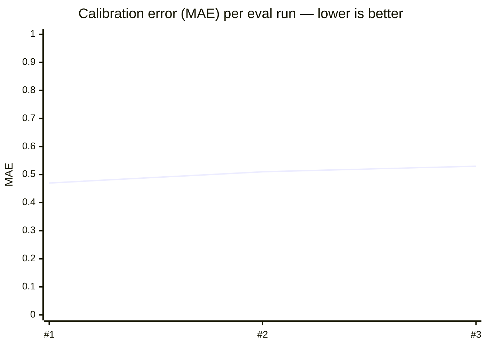
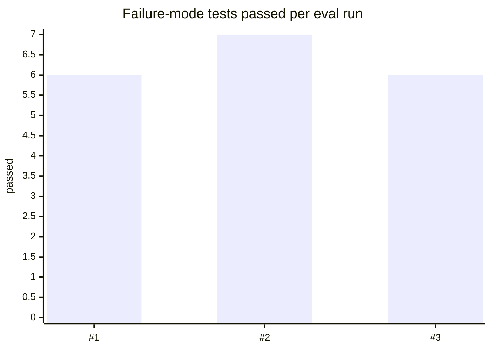

# Performance

> Auto-generated by `npm run report` from [`eval/results/history.jsonl`](../eval/results/history.jsonl). Do not edit by hand.
> Usage and user-feedback stats live in [USAGE.md](USAGE.md).

## Latest

| Metric | Latest | Target |
|---|---|---|
| Calibration MAE vs human labels | **0.53** | ≤ 0.80 |
| Bias (+ = AI too generous) | **+0.35** | within ±0.30 |
| Scores within ±1 of human | **98%** | ≥ 85% |
| Ranking agreement | **18/18** | 100% |
| Failure-mode tests passed | **6/7** | 100% |
| Latency per answer (p50 / p95) | **not yet measured** | < 15s p50 |
| Tokens per answer | **—** | — |

Latest run: 2026-10-04 01:55 UTC · `openai/gpt-oss-120b` · 15 cases × 2 run(s) · local

## Trend

## Run history

| Date | Model | Runs/case | MAE | Bias | ±1 | Rank | Fail-mode | p50 | p95 | Tokens | Status | Note |
|---|---|---|---|---|---|---|---|---|---|---|---|---|
| 2026-10-04 01:55 UTC | `openai/gpt-oss-120b` | 2 | 0.53 | +0.35 | 98% | 18/18 | 6/7 | — | — | — | ⚠️ | same code as previous run |
| 2026-10-04 01:46 UTC | `openai/gpt-oss-120b` | 2 | 0.51 | +0.31 | 98% | 18/18 | 7/7 | — | — | — | ⚠️ | after rewrite audit + resume-conflict fixes |
| 2026-10-04 01:36 UTC | `openai/gpt-oss-120b` | 1 | 0.47 | +0.28 | 100% | 18/18 | 6/7 | — | — | — | ⚠️ | baseline |

✅ = meets all targets (MAE ≤ 0.8, |bias| ≤ 0.3, ≥85% within ±1, all failure-mode tests pass).

## Guardrail activity (latest run)

_not recorded for this run_

High counts of `rewrite_repaired` or `dropped_unverified_quote` mean the underlying model often makes unsupported claims and the guardrails are doing real work — see [failure-modes.md](failure-modes.md).

## How these numbers are produced

- **Calibration** — 8 human-labelled answers; the AI's per-criterion scores are compared to the labels (single rater — see caveat in [evaluation-framework.md](evaluation-framework.md)).
- **Failure modes** — 7 adversarial cases with machine-checkable expectations.
- **Latency / tokens** — wall time and token usage across all model calls for one answer (evaluate + rewrite audit), measured in `lib/llm.js`.
- Runs: `npm run eval` locally, or the **Eval** GitHub Actions workflow (manual + weekly), which also publishes this summary to the run page.
