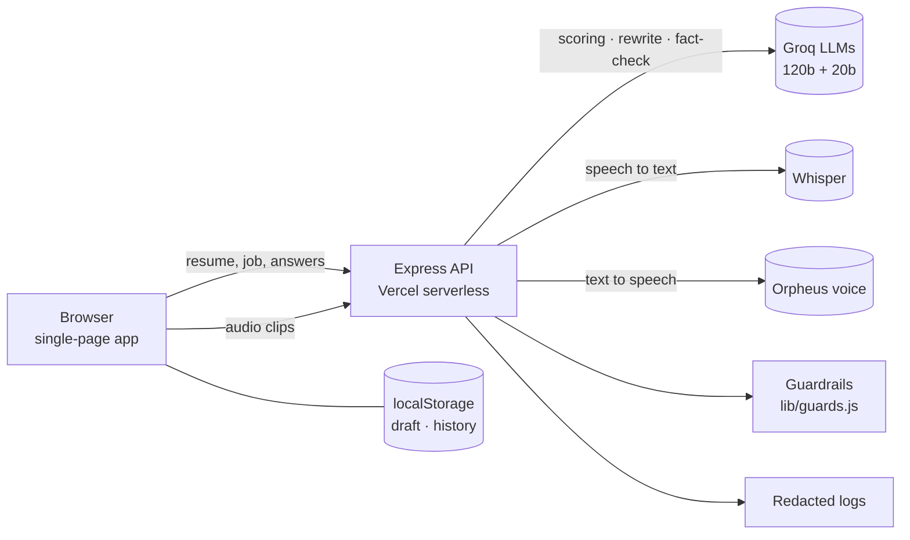
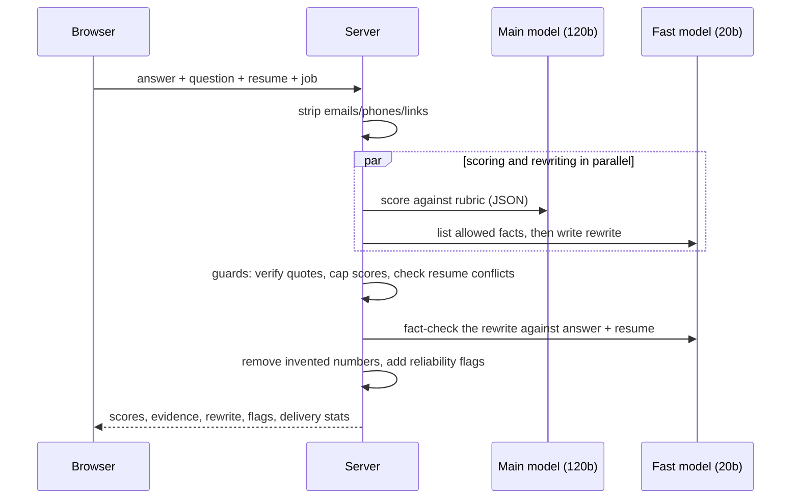
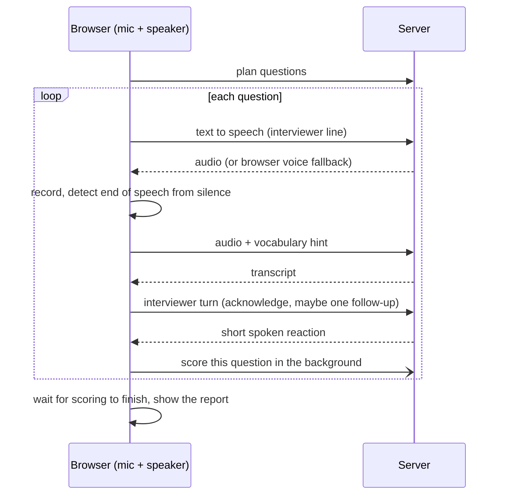

# Architecture

A small Express API plus a single-page front end. There is no database and no user accounts: all long-lived state lives in the browser, and the model providers are called from the server.

## Scoring one answer

If the main model's daily free quota is exhausted, the scoring call switches to the smaller model immediately and the answer is flagged as less reliable.

## Live voice interview

The conversation is half-duplex (it never listens while speaking), so no echo cancellation of the interviewer's voice is needed.

## Design decisions

| Decision | Why |
|---|---|
| Rubric in one file (`lib/rubric.js`) | The prompt, the UI and the evaluation all use the same definition of a good answer |
| Structured JSON output, schema-checked | Free-form model text is brittle; every field the UI needs is validated or defaulted |
| Guards in code after the model | Anything that can be checked mechanically (quote exists, number in source, score caps) should not rely on the model's own claims |
| Separate fact-check pass for the rewrite | A second call with only the sources and the rewrite catches invented facts that regexes can't |
| Cheaper model for rewrite, fact-check and interviewer turns | They are short and latency-sensitive; they also use a different free-tier token bucket |
| No accounts or database | Keeps the project free to host and removes personal data from the server; history is stored locally |
| Contact details stripped before any model call or log | They are never needed to coach an answer |
| Half-duplex voice with silence detection | Simple, robust across browsers, and avoids echo problems |

## Limits of this design

- Free-tier AI limits cap throughput (roughly 60–80 scored answers a day on the main model). A paid key removes this.
- Rate limits are per serverless instance unless the optional shared store is configured.
- Speech quality depends on the browser and microphone; delivery statistics use the transcript, not the audio.
